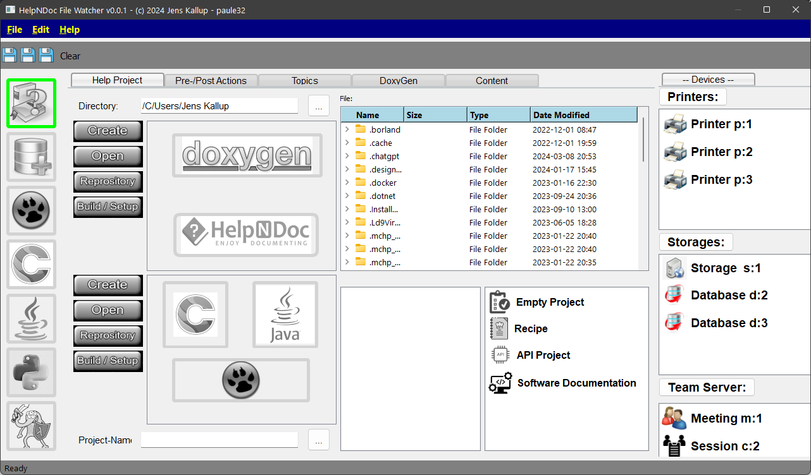
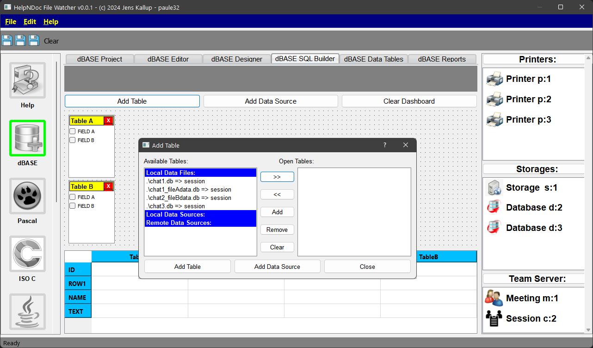
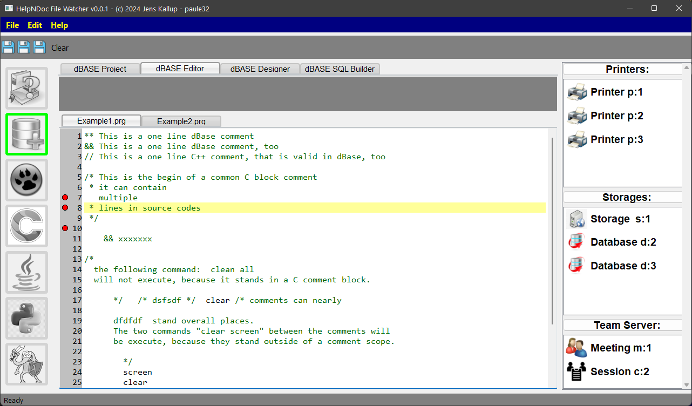
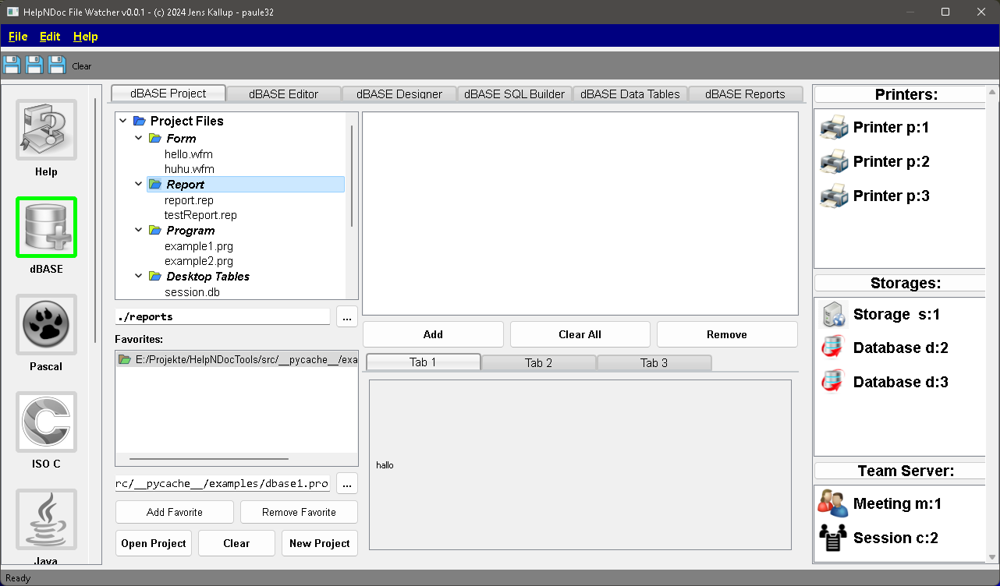
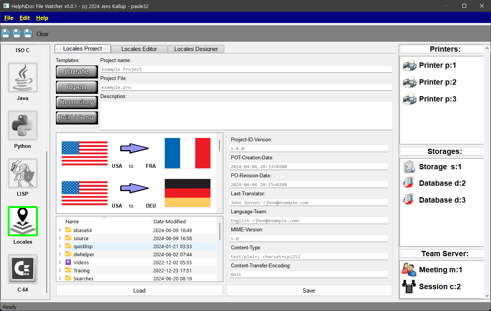
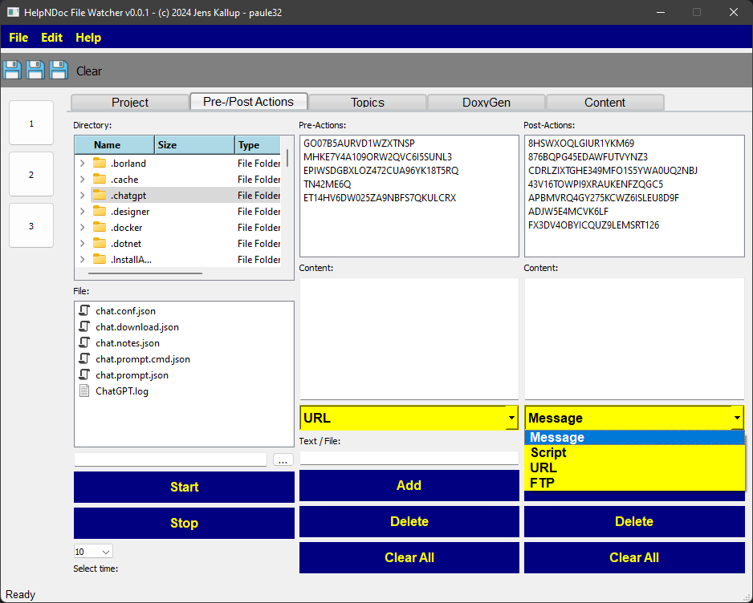
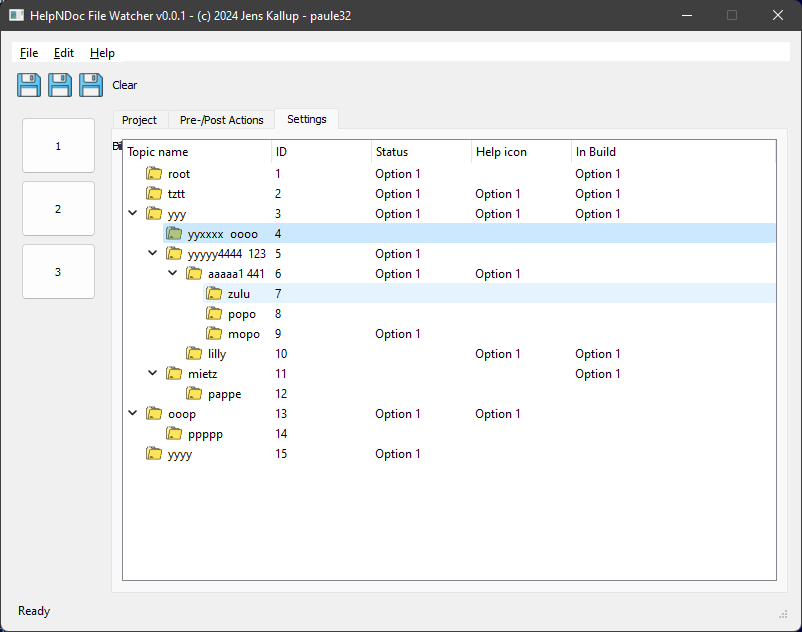
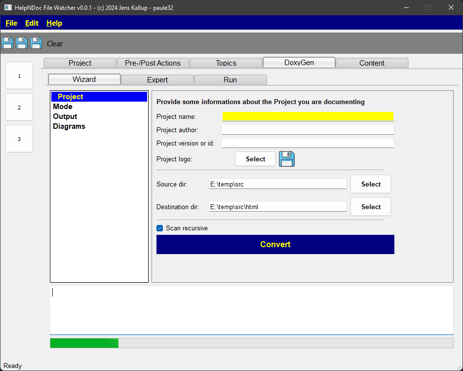
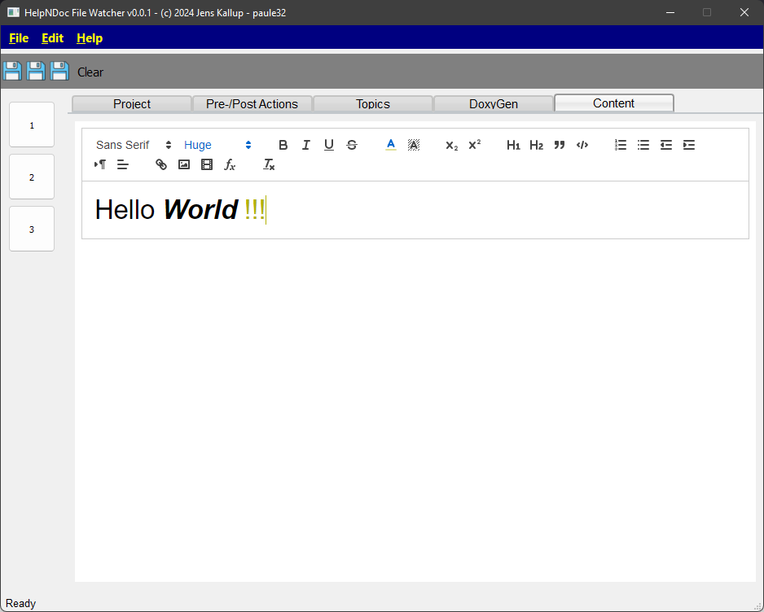

# HelpNDocTools
Some stuff for "HelpNDoc" (www.helpndoc.com) - the Help authoring Software for CHM, HTML, PDF, ... help projects.
To download the Windows 10 64-Bit Professional based Application, you can visit:
[Application](https://kallup.net/HelpNDoc/pyapp/)

Here are some out dated screen shoot on running the application:
For the Commodore C-64 TrueType Font, visit: [C64Font](https://style64.org/release/c64-truetype-v1.2.1-style)

Preview Front-Window A2:

Preview Design-Window A3:

Preview Design-Window A4:

Preview Design-Window A5:

Preview Design-Window A6:

Preview Design-Window A7:

Preview Locales-Projekt-Window A70:

Preview Locales-Projekt-Window A712:

Preview Locales-Projekt-Window A71:

Preview Design-Window A72:

Preview Design-Window A6:

Preview Front-Window 1:

Preview Front-Window 2:

Preview Front-Window 3:

Preview Front-Window 4:

Preview Front-Window 5:

Preview Front-Window 6:

