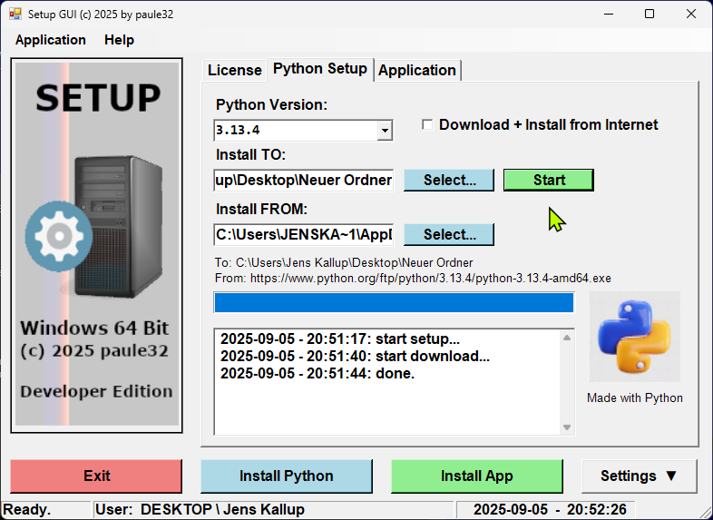

# HelpNDocTools
# Hybrid DOS + PE32+ Single-EXE Projekt

Kurz: Dieses Projekt verbindet 16-Bit DOS-Code und 64-Bit Windows (PE32+) Code in einem einzigen ausführbaren Image. Ziel ist eine *flat EXE*, die ohne traditionellen Linker erzeugt wird. Die ausführbare Datei startet unter DOS (z. B. DOSBox) den 16-Bit-Teil und unter Windows den 64-Bit-PE-Teil.

## Inhalt des Repos
- `winhdr.inc`  — manueller PE32+ Header, Optional Header und Section Table (dynamisch berechnet).
- `precalc.asm` — Makros / Berechnungen (SIZEOF_HEADERS, SIZEOF_IMAGE usw.).
- `code64.asm`  — Win64 Entry / Windows-Code (GUI / minimal).
- `code16.asm`  — DOS 16-Bit Stub (Interrupt-Services, DOS exit).
- `start.asm`   — Zusammenführung / Layout / Dispatcher.
- `packed.zip`  — (optional) Beispiel Build / Test-Artefakt.

## Schlüsselideen & Probleme, die gelöst wurden
1. **PE Header Konsistenz**
   - `SizeOfHeaders` im Optional Header **muss** mit dem realen, gepaddeten Header („file-padded to FILEALIGN“) übereinstimmen.
   - Fix: `dd SIZEOF_HEADERS` und `times (SIZEOF_HEADERS - ($ - $$)) db 0`.

2. **SizeOfImage korrekt berechnen**
   - `SizeOfImage = ALIGN_UP(max(Section.VirtualAddress + Section.VirtualSize), SectionAlignment)`.

3. **Win64 ABI / Stack-Alignment**
   - Beim Windows-Entry gilt: `RSP ≡ 8 (mod 16)` beim Eintritt. Vor jedem `call` muss jedoch `RSP ≡ 0 (mod 16)` sein **und** 32 Byte „shadow space“ müssen bereitstehen.
   - Fix im Prolog: `sub rsp, 40` (32B shadow + 8B alignment correction). Dann `mov ecx, <exitcode>` und `jmp qword [rel IAT_win32_ExitProcess]` (Tail-call, da ExitProcess nicht zurückkehrt).

4. **EntryPoint-Ausrichtung vs. tatsächlicher Startcode**
   - Ein häufiger Fehler: `AddressOfEntryPoint` zeigt nicht exakt auf das Label, das den Win64-Prolog enthält (stattdessen z. B. 3 Byte früher). Folge: Loader startet bei `ret`/NOP → Crash.
   - Fix: Entry auf genau die erste Prolog-Instruktion setzen oder `.text` so anordnen, dass das erste Byte der Section der Prolog ist. Alternativ: 5-Byte `jmp` an den realen Einstieg setzen.

5. **IAT / Import Table**
   - RIP-relative `call qword [rel IAT_ExitProcess]` muss auf einen gültigen QWORD zeigen, der vom Loader zur Laufzeit mit der Adresse der API gefüllt wird.
   - Debug: `dq <IATaddr>` prüfen und disassemblen (`u poi(IATaddr)` in WinDbg).

## Build (Hinweis: verwendete NASM-Variante ist die Windows-Version)
> Die Projekt-Buildschritte hängen von deinem Make/Build-Script ab. Grundsätzlich:
1. Säubere altartefakte.
2. `nasm` deine .asm-Dateien (so, wie dein Layout es erfordert).
3. Resultat ist ein einzelnes EXE-Image (`dos.exe`).

> Hinweis: In diesem Projekt wird bewusst **kein** linkerischer PE-Linker verwendet — die Sections, Header und IAT werden manuell in Assembler erzeugt.

## Test & Debug
### Kurztests
- SHA256 prüfen: `certutil -hashfile dos.exe SHA256`
- Header prüfen: `dumpbin /headers dos.exe` (AddressOfEntryPoint, SizeOfHeaders, SizeOfImage, DataDirectories).
- Imports prüfen: `dumpbin /imports dos.exe`

### x64dbg (Entry / IAT prüfen)
- `File → Open` → `dos.exe`
- Break am EntryPoint (x64dbg hält idR automatisch).
- Disasm: `sub rsp, 28h / mov ecx, 2 / jmp qword [rel ...]`
- Rechtsklick auf `jmp` → `Follow in Dump` → `dq` → QWORD sollte auf `kernel32`/`ntdll` zeigen.
- Wenn `dq` == 0 → IAT nicht gepatcht → prüfe `.idata`-Directory-/Section-RVAs.

### WinDbg Checks (kompakt)
- `bp @$exentry` ; `g`
- `u rip L3` ; `r`
- `r @$t0 = rip + <offset nach instr>` ; `dq @$t0 L1`
- `lm` ; check module ranges

## Troubleshooting (häufige Fehlerquellen)
- `SizeOfHeaders` != tatsächliche Header-Padding → Loader patcht IAT/Sections falsch → Crash.
- EntryPoint zeigt nicht exakt auf Prolog → RET/NOP am Anfang → Crash.
- Stack-Alignment nicht berücksichtigt → `0xC0000005` bei WinAPI-Aufrufen.
- IAT-RVA/Size falsch gesetzt → Loader füllt IAT nicht.
- ASLR/Relocs (wenn Du reloc-stripped baust, wähle ein geeignetes `ImageBase`).

## Hinweise zur Weitergabe / Lizenz
- Dieses Projekt enthält gemischten Code (16-Bit / 64-Bit). Wenn du den Code in ein öffentliches Repo hochlädst, entferne evtl. lokale Pfade, private Keys oder persönliche Daten aus Headers.

**Update** on: 2025-10-05  11:15 pm 

Working pre-alpha Release Code available under: [Playground](https://kallup.net/myapp/packed.zip).  
Tested with Python 3.13 under Windows 11 64-Bit Pro.  
**0.** - download and depack zip archive 
**1.** - start -> setup.bat  
**2.** - navigate to .\src (**cd src**) 
**3-** - start -> start.bat  

Some stuff for "HelpNDoc" the Help authoring Software for CHM, HTML, PDF, ... help projects.
To download the Windows 10 64-Bit Professional based Application, you can visit: 
[Application](https://kallup.net/woops/)

Now, I working on a Setup Script to install the Python Application and the used Modules, used in this Reprository Applicationö.
Only Windows 10/11 64 Bit is supported.

Here are some out dated screen shoot on running the application:
For the Commodore C-64 TrueType Font, visit: [C64Font](https://style64.org/release/c64-truetype-v1.2.1-style)

Alpha Terminal Server Screen:

Setup PowerShell Applet:

Setup PowerShell Applet:

Electronic Playground:

Windows XO Dekstop in Action:

Programmers Desktop - Windows 10 Pro Multi-Monitor:

Preview Úbuntu Linux - Hyper-V under Windows:

Preview Úbuntu Linux - Hyper-V under Windows:

Preview LogIn-Window A1:

Preview desktop-Window A1:

Preview Front-Window A2:

Preview Design-Window A3:

Preview Design-Window A4:

Preview Design-Window A5:

Preview Design-Window A7:

Preview Locales-Projekt-Window A70:

Preview Locales-Projekt-Window A712:

Preview Locales-Projekt-Window A71:

Preview Design-Window A72:

Preview Design-Window A6:

Preview Front-Window 1:

Preview Front-Window 2:

Preview Front-Window 3:

Preview Front-Window 4:

Preview Front-Window 5:

Preview Front-Window 6:

Preview dBase-Editor Window-App:

Preview Pascal-Editor dummy flummy:

